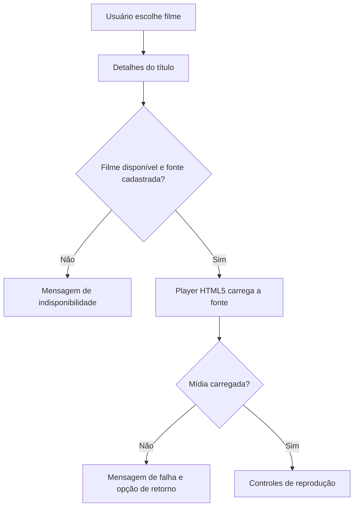

# ENTREGA SEMANAL DE REQUISITOS

**Data de Entrega:** 03/10/2026  
**Grupo:** Grupo 04 - Cinemark  
**Integrantes:** Fabrício Aguiar (fabricio62258946@edu.df.senac.br); João Silva (joao61806466@edu.df.senac.br); Natanael Souza (natanael61421786@edu.df.senac.br)

---

## 1. IDENTIFICAÇÃO DO REQUISITO

### RF-004: Reprodução de Filmes

**ID:** RF-004  
**Título:** Assistir filmes na plataforma  
**Prioridade:** Alta — a reprodução de filmes é a principal finalidade da plataforma de streaming.  
**Complexidade:** 8 story points — estimativa para consulta do catálogo, detalhes, integração do player e estados de erro; sujeita à revisão da equipe.  
**Status:** Especificado; reprodução de vídeos ainda não implementada no protótipo.  
**Tipo:** Requisito Funcional

**Breve Descrição:**  
O sistema permite que o visitante ou cliente consulte um filme disponível, veja seus detalhes e inicie sua reprodução quando houver uma fonte de vídeo válida associada ao título. O player oferece controles de reprodução compatíveis com o navegador e informa indisponibilidade ou falha de carregamento.

---

## 2. DESCRIÇÃO E ATORES

### Descrição Detalhada

O catálogo apresenta os filmes disponibilizados pela plataforma. Ao escolher um título, o usuário consulta os metadados cadastrados e pode iniciar a reprodução de seu conteúdo. A reprodução ocorre em um player de vídeo HTML5, com controles de iniciar, pausar, avançar, voltar, volume e tela cheia, conforme suporte do navegador e do arquivo.

Cada filme precisa possuir uma fonte de vídeo válida, identificada por caminho relativo servido pelo próprio site ou por endereço HTTPS autorizado pelo projeto. A fonte deve ser mantida separada do pôster e da sinopse. O arquivo de vídeo não deve ser gravado no `localStorage`; no protótipo, o armazenamento local mantém somente os metadados e o endereço da mídia.

O protótipo consultado não possui arquivos de vídeo nem um campo de fonte de vídeo no cadastro de filmes. Portanto, este requisito especifica uma evolução ainda pendente e não afirma que já seja possível assistir aos filmes cadastrados. A reprodução real também depende de conteúdo de demonstração que o grupo tenha autorização para utilizar.

### Atores do Sistema

#### 1. Visitante ou cliente (ator principal)

- **Papel:** Encontrar um título e iniciar sua reprodução.
- **Responsabilidades:** Selecionar o filme, iniciar ou controlar a reprodução e comunicar falhas percebidas no player.
- **Permissões:** Consultar os títulos disponíveis e reproduzir aqueles que possuem uma fonte válida.
- **Restrição observada:** O protótipo não possui controle implementado de assinatura, cobrança ou autorização por plano. Este requisito não pressupõe paywall.

#### 2. Administrador (ator de suporte)

- **Papel:** Manter o catálogo e a fonte de vídeo associada a cada filme.
- **Responsabilidades:** Informar ou atualizar o endereço da mídia, verificar se o título está disponível e retirar do catálogo fontes inválidas.
- **Dependência:** O painel do RF-003 ainda não possui campo para endereço de vídeo; esse cadastro precisa ser incluído antes de validar o fluxo completo.

#### 3. Sistema (ator automático)

- **Papel:** Apresentar os detalhes, carregar a fonte e controlar os estados do player.
- **Responsabilidades:** Impedir tentativa de reprodução sem fonte, exibir mensagens compreensíveis em caso de falha e manter os controles utilizáveis em desktop e dispositivos móveis.

---

## 3. ESPECIFICAÇÃO DE CASOS DE USO

### UC-004: Assistir a um filme

#### Pré-Condições

- O filme deve estar cadastrado e disponível no catálogo.
- O registro deve possuir uma fonte de vídeo válida e acessível pelo navegador.
- O navegador deve oferecer suporte ao elemento HTML5 `<video>` e ao formato da mídia.
- O dispositivo deve possuir conexão ou acesso local ao arquivo de vídeo.

#### Pós-Condições (Sucesso)

- O vídeo selecionado é exibido no player.
- O usuário consegue controlar a reprodução pelos controles disponíveis.
- O título e a classificação indicativa permanecem identificados durante o fluxo.

#### Pós-Condições (Falha)

- A interface informa que o conteúdo não pode ser reproduzido ou carregado.
- O usuário pode retornar ao catálogo sem perder a navegação.
- Nenhum registro de filme é alterado por uma tentativa de reprodução.

#### Fluxo Principal

1. O usuário abre a página inicial ou o catálogo de filmes.
2. O sistema lista os filmes disponíveis para consulta.
3. O usuário seleciona um título.
4. O sistema apresenta título, sinopse, gênero, ano e classificação indicativa.
5. O sistema verifica se o filme possui uma fonte de vídeo cadastrada.
6. O usuário aciona **Assistir**.
7. O sistema carrega a mídia no player sem iniciar áudio ou reprodução automática antes da ação do usuário.
8. O usuário inicia a reprodução e utiliza os controles disponíveis.
9. O usuário pode pausar, retomar, buscar outra posição, ajustar o volume ou ativar tela cheia.
10. O usuário retorna ao catálogo ou fecha a página do filme.

#### Fluxos Alternativos

**A1: Filme sem fonte de vídeo**

1. O sistema identifica que o filme não possui endereço de mídia.
2. O sistema mantém o botão de reprodução indisponível ou o substitui por uma mensagem de conteúdo indisponível.
3. O sistema oferece retorno ao catálogo.

**A2: Falha ao carregar ou reproduzir a mídia**

1. O navegador informa erro, indisponibilidade de rede ou formato incompatível.
2. O sistema apresenta mensagem de falha sem exibir controles como se a reprodução estivesse ativa.
3. O usuário pode tentar novamente ou retornar ao catálogo.

**A3: Filme removido ou indisponível**

1. O sistema não encontra o filme solicitado ou identifica que ele não está mais disponível.
2. O sistema informa que o título não está disponível.
3. O sistema apresenta um link para o catálogo.

**A4: O usuário pausa ou busca outra posição**

1. O usuário aciona pausa ou seleciona uma posição na barra de progresso.
2. O player aplica a ação quando a mídia permite a operação.
3. O sistema atualiza o estado visual dos controles.

### Regras de Negócio (RN)

**RN-01:** Somente filmes marcados como disponíveis podem ser apresentados como reproduzíveis.  
**RN-02:** Um filme só pode iniciar a reprodução quando possuir uma fonte de vídeo válida.  
**RN-03:** A fonte deve ser um caminho relativo da aplicação ou um endereço HTTPS autorizado pelo projeto; esquemas como `javascript:` não são aceitos.  
**RN-04:** Pôster, sinopse e metadados não substituem a fonte do vídeo.  
**RN-05:** A classificação indicativa deve ficar visível nos detalhes do título; o protótipo não implementa controle parental nem verificação de idade.  
**RN-06:** A reprodução só começa após ação explícita do usuário.  
**RN-07:** Erro ou ausência de fonte não pode alterar os dados do filme nem simular uma reprodução concluída.  
**RN-08:** O player utiliza os recursos suportados pelo navegador e pelo formato fornecido; não promete compatibilidade com qualquer codec.  
**RN-09:** Os arquivos de mídia não são armazenados em `localStorage`.  
**RN-10:** Assinaturas, pagamentos, histórico de reprodução, retomada entre dispositivos e download offline estão fora do escopo deste requisito.

### Requisitos Não Funcionais

| ID | Requisito e critério de aceitação | Situação |
|---|---|---|
| RNF-01 | A página do filme e o player devem se adaptar a larguras de 375, 768 e 1280 px, sem cortes nos controles ou rolagem horizontal indevida. | Pendente de implementação e revisão visual |
| RNF-02 | Os controles do player devem ser operáveis por teclado; botões próprios devem possuir nome acessível, foco visível e estado perceptível. | Pendente de implementação e teste de acessibilidade |
| RNF-03 | A página deve exibir título e classificação indicativa junto ao player, inclusive em telas pequenas. | Pendente de implementação |
| RNF-04 | Falha de rede, fonte ausente e formato incompatível devem produzir estado de erro legível, sem travar a navegação. | Pendente de implementação e teste |
| RNF-05 | O fluxo deve ser verificado nas duas últimas versões estáveis de Chrome, Firefox e Safari, usando um arquivo de vídeo de teste autorizado. | Matriz de compatibilidade pendente |
| RNF-06 | A primeira reprodução deve depender de ação explícita do usuário; não deve iniciar automaticamente com áudio. | Critério definido; teste pendente |
| RNF-07 | A aplicação deve aceitar somente caminhos relativos ou URLs HTTPS aprovadas para a fonte de mídia. | Regra definida; validação no painel pendente |
| RNF-08 | O tempo de início depende do tamanho do arquivo, rede, codec e servidor; não há meta de streaming adaptativo neste protótipo. | Limitação documentada; CDN/streaming adaptativo fora do escopo |

---

## 4. PROTÓTIPOS / TELAS

### Protótipo Existente

A página inicial e o catálogo são implementados em `src/prototipos/SEMANA-05/RF-003-GESTAO-DE-FILMES/index.html` e `filmes.html`. O catálogo atual consulta os filmes mantidos pelo `js/store.js`, mas ainda não apresenta detalhes com player e os registros não possuem endereço de vídeo. A tela de reprodução descrita abaixo é uma proposta para implementação do RF-004.

### Mockups das Telas

**Tela 1: Catálogo de filmes**

```text
┌─────────────────────────────────────────────────────────────────────┐
│ Cinemark            Início   Filmes   Loja   Entrar                 │
├─────────────────────────────────────────────────────────────────────┤
│ FILMES PARA DESCOBRIR                                                │
│                                                                     │
│ [Buscar título...] [Gênero v]                                       │
│                                                                     │
│ [Pôster]  Título do filme                  [Pôster]  Outro título   │
│           Gênero · ano · classificação        Gênero · classificação│
│           [Ver detalhes]                      [Ver detalhes]        │
└─────────────────────────────────────────────────────────────────────┘
```

**Tela 2: Detalhes e reprodução**

```text
┌─────────────────────────────────────────────────────────────────────┐
│ [← Catálogo]                                                        │
│                                                                     │
│ ┌───────────────────────────────────────────────────────────────┐   │
│ │                                                               │   │
│ │                    PLAYER DE VÍDEO                            │   │
│ │                                                               │   │
│ │ [Reproduzir] ────────────────●────────── 00:00 / 00:00   [⛶]  │   │
│ └───────────────────────────────────────────────────────────────┘   │
│ Título do filme · Gênero · Ano · Classificação indicativa           │
│ Sinopse                                                             │
└─────────────────────────────────────────────────────────────────────┘
```

**Estado sem fonte ou com falha:** o player apresenta “Este filme está temporariamente indisponível” ou “Não foi possível carregar o vídeo”, preserva o título e oferece a ação **Voltar ao catálogo**.

### Fluxo de Navegação

1. O visitante abre a home e segue para o catálogo.
2. O visitante seleciona um filme e consulta seus detalhes.
3. O sistema verifica a disponibilidade e a fonte de vídeo cadastrada.
4. O usuário inicia a reprodução ou recebe o estado de indisponibilidade.
5. O usuário controla o player ou retorna ao catálogo.

---

## 5. ARQUITETURA E DECISÕES TÉCNICAS

### Arquitetura da Solução Proposta

```text
┌────────────────────────────────┐
│ Navegador                      │
│ home/index + catálogo + filme  │
│ detalhes + player HTML5        │
└──────────────┬─────────────────┘
               │ consulta título e fonte
               ▼
┌────────────────────────────────┐
│ Store (store.js)               │
│ metadados e endereço do vídeo  │
└──────────────┬─────────────────┘
               │ endereço da mídia
               ▼
┌────────────────────────────────┐
│ Arquivo local autorizado ou    │
│ URL HTTPS autorizada           │
└────────────────────────────────┘
```

### ADR-001: Player HTML5

**Status:** Proposto para implementação.  
**Contexto:** O protótipo é composto por páginas HTML, CSS e JavaScript e ainda não possui player ou backend.  
**Decisão:** Utilizar o elemento nativo `<video controls>` para reproduzir mídias fornecidas em formatos suportados pelo navegador.  
**Alternativa rejeitada:** Incorporar um serviço de streaming de terceiros sem contrato, fonte licenciada ou requisito definido.  
**Consequências:** Implementação adequada ao protótipo, sem streaming adaptativo, DRM, sincronização de progresso ou garantia de reprodução de qualquer codec.

### ADR-002: Endereço da mídia separado do arquivo

**Status:** Proposto para implementação.  
**Contexto:** O painel RF-003 registra título, sinopse e pôster, mas não uma fonte de vídeo. Arquivos de vídeo também não devem ser gravados no `localStorage`.  
**Decisão:** Incluir no registro do filme um endereço relativo ou HTTPS validado e permitir que o painel o mantenha.  
**Consequências:** A reprodução depende de um arquivo acessível na origem ou de um servidor HTTPS autorizado. O protótipo não fará upload nem hospedará vídeos.

### Fluxo de dados proposto



### Limitações e Segurança

O protótipo utiliza `localStorage`, não possui backend, hospedagem de mídia ou autenticação de produção. A fonte de vídeo guardada localmente não torna o conteúdo privado ou protegido. URLs externas devem ser limitadas a HTTPS e aprovadas pelo projeto; validação apenas no navegador não substitui validação no servidor.

Os vídeos utilizados em demonstrações devem ser próprios, licenciados ou autorizados para esse uso. O requisito não autoriza incorporar filmes comerciais ou contornar DRM. Não há assinatura, cobrança, controle parental, histórico, retomada de posição entre dispositivos, download offline, legendas próprias ou streaming adaptativo especificados nesta etapa.

Compra de lanches e brinquedos é complementar ao produto e deve ser descrita em requisito de loja separado. O protótipo permite consultar itens de lanchonete e brinquedos e adicioná-los ao carrinho; a finalização continua demonstrativa e não há pagamento real nem integração de estoque.

### Tecnologias Utilizadas

| Camada | Tecnologia | Uso previsto |
|---|---|---|
| Estrutura das telas | HTML | Catálogo, detalhes e player |
| Estilos | CSS | Player responsivo e estados visuais |
| Comportamento | JavaScript | Consulta de disponibilidade e mensagens de erro |
| Metadados | `localStorage` via `Store` | Dados do filme e endereço da mídia no protótipo |
| Reprodução | Elemento HTML5 `<video>` | Controles nativos do navegador |
| Mídia | Arquivo relativo ou URL HTTPS aprovada | Fonte de vídeo autorizada |

---

## 6. QUALIDADE E CONFORMIDADE

- [x] Requisito alinhado ao posicionamento de plataforma de streaming.
- [x] Fluxo principal e alternativas de falha especificados.
- [x] Limites do protótipo atual registrados; não há afirmação de reprodução já implementada.
- [x] Compra de lanches e brinquedos separada do fluxo de reprodução.
- [ ] Adicionar fonte de vídeo ao cadastro/edição de filmes do painel RF-003.
- [ ] Disponibilizar arquivo de demonstração autorizado e testar reprodução em navegadores previstos.
- [ ] Implementar tela de detalhes e player responsivo.
- [ ] Validar controles por teclado, estados de erro e acessibilidade.
- [ ] Definir com o professor se há exigência de login ou assinatura antes da reprodução.

---

**Observação:** Este documento especifica o RF-004 proposto para o Cinemark. A implementação do player depende de uma fonte de vídeo autorizada e da inclusão do respectivo endereço no cadastro de filmes. O documento não presume backend, assinatura, pagamento ou hospedagem de conteúdo.